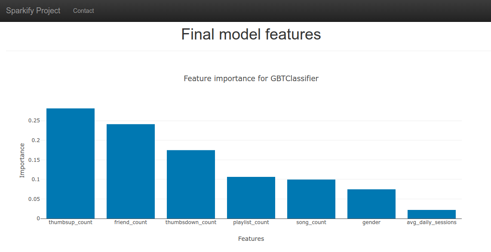

# Sparkify

***

## Project Overview

Sparkify is a music streaming company similar to Spotify or Apple music. The business model is based on the users having a free or premium subscription. The user at any time can downgrade their subscription to free or cancel. The interactions the user has with the system are monitored and logged by the system.

The project's goal is to identify users at risk of canceling the service by using the system's data. Identifying these users before they cancel will help Sparkify increase retention and maintain the business's bottom line.

## Problem Statement

The first step is to explore the data, clean the data, and identify users who have churn. After performing the first step, the data will be visualized to explore various columns and identify these users' patterns. In the third step, features will be created from the data to predict if a user will churn. Finally, various machine learning models will be fitted and tested. The best model will be selected to assist Sparkify in identifying users who might churn in the future.

## Metrics

The dataset is imbalanced because around 22% percent of users have canceled the service. The metric that will be used for the best model is the F1 Score. The metric will give a better measure of incorrectly classifying a case. Additionally, we will also output the accuracy and AOC area under the curve that can be used to grade the model.

## LIBRARIES

    * pandas
    * Flask
    * pyspark
    * seaborn
    * plotly


* install python 3.8
* Install required packages with:
    * pip install -r requirements.txt

**Step Run app** -  run.py - run at root of app folder.

cmd - python app.py

## FOLDER STRUCTURE

```
- app 
| - template
| |- master.html - main page of web app
|- run.py  - Flask file that runs app
| - data
| |- features.csv - file containing a best model features

```

* `best_GBTClassifier_model` - Folder with Spark ML saved model
* `imgs` - App pictures
* `requirements.txt` - File containing all python module requirements
* `Sparkify.ipynb` - File containing project code

# WEB APP SCREENSHOTS




## Results

After hyperparameter tuning, the GBT model did perform better. There is evidence that this was due to the additional training. The numFolds was kept low to reduce training time for the project, especially after Identifying an issue with the training data where the models were using incorrect features. The results indicate that further training could improve the model. The total number of features gave the gradient boosting model a better performance than SVM. The increase in metrics might increase as the data gets bigger and more features are added.

Should additional training not increase model performance. More feature engineering could be required. For Example, identifying gaps at logon or just looking back a couple of weeks to see if the user behavior has changed.

## Best Model
Model GBT
Metrics
Accuracy:  0.7435897435897436
F-1 Score:  0.7006639194139195
Area under ROC Curve:  0.5655172413793104

## Reflection

The project was fascinating because it allows the data scientist to tackle a potential real-world scenario where not all the data fits into memory. Understanding user behavior was critical for the project to be successful. While the ideal model was not reached, insight into the data was achieved in the exploration and the model building phase. 

## Improvement

I think two areas of improvement that could be implemented are moving to the full dataset and training the model for a more extended period and additional hyperparameters. Moving the model to the full data set would undoubtedly change the exploratory analysis but yielding more patterns for the model to identify. Training would surely increase as data increased but also yielding a more accurate model.

## Acknowledgements

* [udacity](https://www.udacity.com/)

